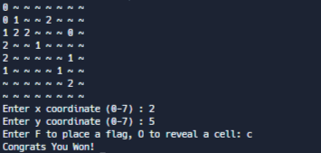

<h1 align="center"> Minesweeper </h1>

# Simplified version of minesweeper using classes

I have implemented the minesweeper game using a variety of different functions defined inside the class, the code prints out a 8 x 8 grid that contains 10 bombs and the user must reveal the 54 other tiles to win the game

# How it works

As soon as you run the code a message is outputted asking the user to Enter "S" to start the game.

Then the user is asked to enter x & y coordinates to reveal the chosen tile.

Then the program asks if the user wants to reveal the tile or flag it, if the user chose to flag the tile the Flag counter would decrement by 1, if the user chose to reveal the tile the "~" character would be replaced by the number of bombs surrounding the chosen tile.

Below is the flagging feature functioning.

If the user were to reveal a tile that contains a mine or a bomb a message would be output mentioning the user's loss and then the code loops and asks for the user to enter "S" to start a new game.

To win minesweeper the user has to reveal all the tiles that dont hold boms, unfortunately I havent been able to win but attached below is what the winning message would look like.

Below is an image of the Game function inside the class which is the main loop that outputs the messages and takes the input from the user 

<h1 align="center"> Errors </h1>

If the user were to input anything other than "F" or "O" when asked, a message as seen below is output.

